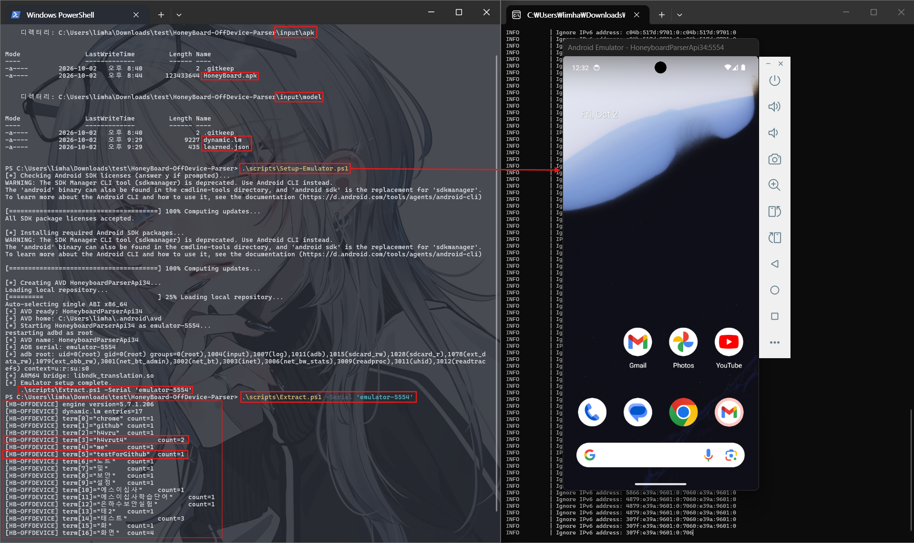

# HoneyBoard Off-Device Parser

Samsung HoneyBoard의 `dynamic.lm`과 `learned.json`을 Android 에뮬레이터에서 열어 학습 단어와 빈도를 전체 출력하는 도구입니다.

> 본인이 소유하거나 분석 권한이 있는 APK와 모델 파일에만 사용하십시오.
> 이 저장소는 HoneyBoard APK, Samsung 바이너리, 사용자 모델 파일 또는
> 해당 파일에서 생성된 빌드 산출물을 배포하지 않습니다.
>
> 실행 과정에서 사용자가 제공한 HoneyBoard APK의 DEX 및 native library가
> 로컬 빌드 산출물에 임시로 포함될 수 있습니다. 이러한 추출물과 생성된
> APK는 재배포하지 마십시오.
>
> 사용자는 자신이 제공하는 소프트웨어와 데이터에 적용되는 라이선스,
> 이용조건 및 관련 법률을 확인할 책임이 있습니다.

## 동작 방식

`Extract.ps1`은 입력한 HoneyBoard APK에서 전체 `classes*.dex`와 `lib/arm64-v8a/libfluency-java.so`를 꺼내 최소 Android 앱과 결합합니다. 이 앱을 에뮬레이터에서 실행한 뒤 Frida로 HoneyBoard의 Fluency 파서를 호출하여 모델에 저장된 모든 단어와 빈도를 나열합니다.

`host/`는 이 파서를 에뮬레이터 프로세스 안에서 실행하기 위한 작은 Android 앱 소스입니다. HoneyBoard 코드나 바이너리는 들어 있지 않으며, 사용자가 제공한 APK의 DEX와 SO는 실행할 때 로컬 빌드 산출물에만 포함됩니다.

## HoneyBoard APK 선택

가능하면 `dynamic.lm`과 `learned.json`을 추출한 기기에 실제로 설치되어 있던 HoneyBoard APK를 사용하십시오. 정확한 APK를 구할 수 없다면 같은 계열의 인접 HoneyBoard 버전을 시도할 수 있습니다.

APK가 필요한 이유는 모델을 해석하는 Java/JNI 인터페이스가 DEX에, 핵심 Fluency 파서가 `libfluency-java.so`에 들어 있기 때문입니다. HoneyBoard 또는 Fluency 버전에 따라 모델 포맷과 인터페이스가 달라질 수 있으므로 임의의 버전이 항상 호환되는 것은 아닙니다.

## 저장소 구조

```text
HoneyBoard-OffDevice-Parser/
├─ config.example.psd1       # 로컬 도구 경로 설정 예시
├─ frida/parse_dynamic_lm.js # 전체 단어와 빈도를 읽는 Frida 코드
├─ host/                     # 파서 실행용 최소 Android 앱 소스
├─ input/
│  ├─ apk/                   # HoneyBoard.apk를 넣는 곳
│  └─ model/                 # dynamic.lm과 learned.json을 넣는 곳
└─ scripts/
   ├─ Setup-Emulator.ps1     # API 34 에뮬레이터 설치·생성·실행
   ├─ Remove-Emulator.ps1    # 생성한 에뮬레이터 AVD 삭제
   ├─ Extract.ps1            # 기본 실행 명령
   ├─ Build-Host.ps1         # APK에서 DEX/SO를 꺼내 실행 앱 생성
   ├─ Run-Parser.ps1         # 에뮬레이터에서 모델 파싱
   └─ Common.ps1             # 공통 경로와 도구 설정
```

## 준비 사항

- Windows PowerShell 5.1 이상
- JDK 17
- Android SDK Command-line Tools
- 같은 버전의 Frida client와 `frida-server`
  - `frida-server` 다운로드: [Frida 공식 Releases](https://github.com/frida/frida/releases)
  - `frida-server` 바이너리는 에뮬레이터 CPU 아키텍처와도 맞아야 합니다.
  - 특정 Frida 버전을 요구하지 않으며, 개발 시 사용한 버전은 17.4.0입니다.

기본 설정은 도구가 저장소 내부의 `.tools`와 `.venv`에 있다고 가정합니다. 다른 위치에 설치했다면 `config.example.psd1`을 `config.psd1`로 복사해 실제 경로를 적거나, 현재 PowerShell 세션에서 다음 환경변수를 설정합니다.

```powershell
$env:HB_ANDROID_SDK = 'C:\path\to\android-sdk'
$env:HB_JAVA_HOME = 'C:\path\to\jdk-17'
$env:HB_FRIDA_CLIENT = 'C:\path\to\frida.exe'
$env:HB_FRIDA_SERVER = 'C:\path\to\frida-server'
```

위 경로는 예시이며 본인 PC의 실제 경로로 바꿔야 합니다. 환경변수는 현재 PowerShell 세션에만 유지되므로 반복해서 사용할 경우 `config.psd1`을 권장합니다.

## 에뮬레이터 준비

다음 명령은 필요한 SDK 패키지를 설치하고 `HoneyboardParserApi34` AVD를 생성·실행한 뒤 `adb root`와 ARM64 translation을 확인합니다. 첫 설치에는 약 7–9 GB의 여유 공간이 필요하며, 이미 호환되는 에뮬레이터가 있다면 이 단계를 생략해도 됩니다.

```powershell
.\scripts\Setup-Emulator.ps1
```

같은 AVD를 지우고 처음부터 다시 생성하려면 다음 두 명령을 실행합니다. 삭제 시 공유 Android SDK 패키지는 유지됩니다.

```powershell
.\scripts\Remove-Emulator.ps1
.\scripts\Setup-Emulator.ps1
```

## 사용법

다음 위치에 세 파일을 넣습니다. `dynamic.lm`과 `learned.json`은 반드시 같은 기기에서 함께 추출한 쌍을 사용합니다.

```text
input/apk/HoneyBoard.apk
input/model/dynamic.lm
input/model/learned.json
```

Android Studio 등으로 호환되는 에뮬레이터를 실행한 다음, 저장소 루트에서 다음 명령을 실행합니다.

```powershell
.\scripts\Extract.ps1
```

실행 중인 에뮬레이터가 하나면 자동으로 선택합니다. 여러 개라면 AVD 이름이 아니라 ADB serial을 지정합니다.

```powershell
& "$env:HB_ANDROID_SDK\platform-tools\adb.exe" devices
& "$env:HB_ANDROID_SDK\platform-tools\adb.exe" -s '<adb-serial>' emu avd name
.\scripts\Extract.ps1 -Serial '<adb-serial>'
```

결과 로그를 원하는 경로에 바로 저장하려면 `-OutputLog`를 지정합니다.

```powershell
.\scripts\Extract.ps1 -Serial '<adb-serial>' -OutputLog 'C:\path\to\parse.log'
```

## 실행 예시



모델의 모든 항목은 다음 형식으로 출력되고 `output/logs/`에도 저장됩니다.

```text
[HB-OFFDEVICE] dynamic.lm entries=<전체 항목 수>
[HB-OFFDEVICE] term[0]="<학습 단어>"    count=<빈도>
[HB-OFFDEVICE] term[1]="<학습 단어>"    count=<빈도>
...
```

로컬 입력 파일은 읽기 전용으로 취급하며, 실행 전후 SHA-256이 달라지면 오류로 중단합니다.
